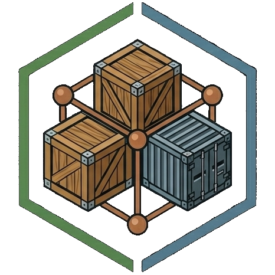
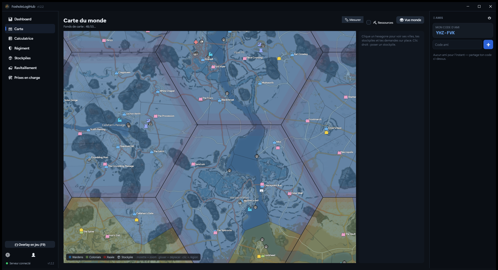
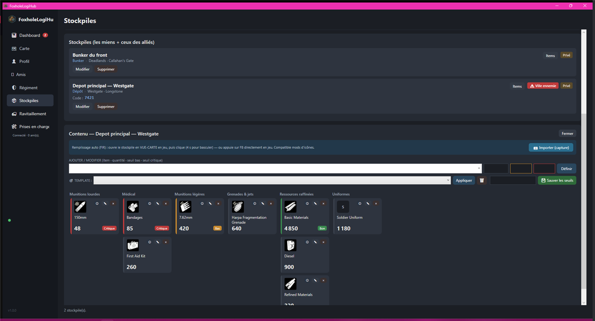
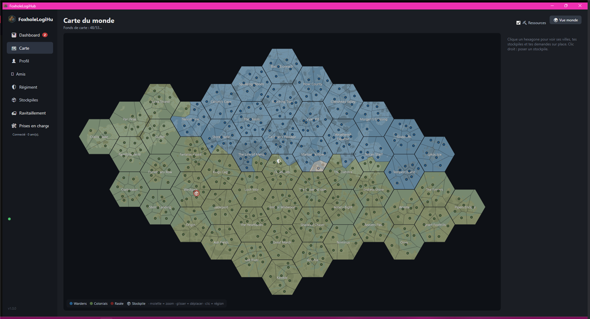
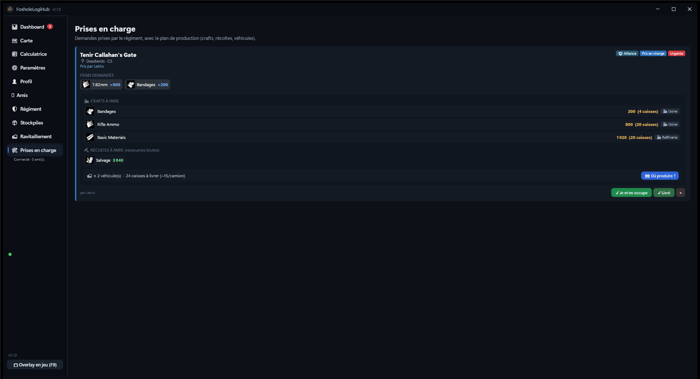
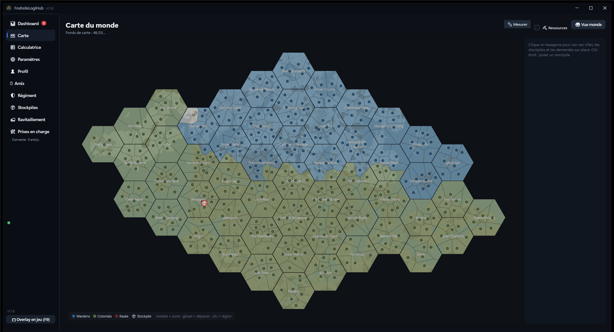

<p align="center">
  
</p>

<h1 align="center">FoxholeLogiHub</h1>

<p align="center">
  <b>Le QG logistique de votre régiment Foxhole.</b><br/>
  Stocks partagés en temps réel · Carte de guerre interactive · Plans de production
</p>

<p align="center">
  <a href="https://github.com/Aegnis42/foxhole-app--logistique/releases/latest"></a>
  <a href="https://github.com/Aegnis42/foxhole-app--logistique/releases"></a>
  <a href="https://github.com/Aegnis42/foxhole-app--logistique/actions/workflows/build.yml"></a>
  <a href="LICENSE"></a>
  
</p>

<p align="center">
  <a href="https://github.com/Aegnis42/foxhole-app--logistique/releases/latest/download/FoxholeLogiHub-win-Setup.exe">
    <b>⬇️ &nbsp;Télécharger pour Windows</b>
  </a>
  &nbsp;·&nbsp;
  <a href="#%EF%B8%8F-installation">Guide d'installation</a>
  &nbsp;·&nbsp;
  <a href="#-bien-démarrer-en-5-minutes">Bien démarrer</a>
</p>

---

La logistique gagne les guerres dans **Foxhole**, mais elle se gère trop souvent à coups de
tableurs et de captures d'écran perdues dans Discord. FoxholeLogiHub centralise tout : les
stocks du régiment se synchronisent en temps réel, la carte de guerre s'actualise toute seule,
et chaque demande de ravitaillement arrive avec son plan de production.

<p align="center">
  
</p>

## Ce que fait l'application

### 📦 Des stockpiles partagés, remplis en une touche

En jeu, ouvrez votre stockpile et appuyez sur **F8** : le contenu est reconnu par capture
d'écran (technologie [FIR](https://github.com/GICodeWarrior/fir)) et synchronisé pour tout le
régiment en quelques secondes. Aucune saisie manuelle.

- **Seuils d'alerte** par item (bas / critique) avec tableau de bord récapitulatif
- **Templates de seuils** : définissez une fois vos objectifs « dépôt de front », appliquez-les partout
- **Historique et tendances** : consommation par heure et estimation « vide dans ≈ X h »
- **Recherche globale** : « où ai-je des 150 mm ? » → tous les stockpiles qui en ont, triés par quantité
- **Transferts** entre stockpiles, avec journal des mouvements
- **Partage** : privé, partagé allié par allié, ou public ; codes de réservation notés

<p align="center">
  
</p>

### 🗺️ La carte de guerre

Fonds de carte **haute résolution** (téléchargés automatiquement au premier affichage), contrôle
des villes **en temps réel** (zones colorées par faction, mise à jour toutes les 5 minutes via
l'API officielle), et des **icônes détaillées et colorées par type** : chaque mine, usine, port
ou dépôt se repère d'un coup d'œil.

- **Filtres par type** : affichez ou masquez chaque famille d'icônes (usines, mines, fortins,
  bases reliques…) — vos choix sont mémorisés
- **Vos stockpiles épinglés**, déplaçables à la souris, avec halo d'alerte si la ville est menacée
- **Pose d'un stockpile au clic droit** (bunker, base de production) à l'endroit exact
- **Mesure de distance** : point A, point B, distance et temps de trajet estimé
- **« Où produire ? »** : depuis une demande de ravitaillement, les usines et champs utiles
  s'illuminent sur la carte
- Zoom et déplacement fluides, du monde entier au détail d'un hexagone

<p align="center">
  
</p>

### 🚚 Du ravitaillement organisé

Créez une demande (« Tenir Callahan's Gate : 800 × 7.62, 200 bandages, 100 obus de 150 ») et
l'application calcule le **plan de production complet** : quoi fabriquer, dans quel bâtiment,
quelles ressources récolter, et combien de camions prévoir.

- Demandes **multi-items** avec priorité, coordonnées et note
- Visibilité **régiment / alliance / publique** — la collaboration inter-régiments est native
- Cycle complet : ouverte → prise en charge → livrée, visible par tous en temps réel
- **Calculatrice logistique** indépendante pour préparer un craft sans créer de demande
- **Suivi des files MPF** avec notification quand la production est terminée

<p align="center">
  
</p>

### 🎮 Pendant que vous jouez

- **Overlay en jeu** (F9) : de petites fenêtres déplaçables par-dessus le jeu en mode fenêtré —
  stockpile au choix, demandes de ravitaillement (avec création rapide), prises en charge
- **Raccourcis configurables** (F5 à F12) pour l'import F8 et l'overlay
- **Notifications Windows** : stock critique, stockpile menacé, MPF terminée, demandes

### 🛡️ Pensé pour les régiments

- **Régiment** avec code d'invitation et **alliances** entre régiments
- **Rôles à permissions fines** : gestion des membres, des stockpiles (création, partage,
  édition, suppression), des demandes de ravitaillement (régiment / alliance), du MPF
- **Amis** et présence en ligne en temps réel
- **Webhook Discord** avec mention de rôle : les alertes arrivent dans votre salon
- **Fin de guerre** : archivez puis repartez à zéro en un clic
- **Tableau de bord** : état de la guerre, points de victoire, toutes vos alertes au même endroit
- **Paramètres complets** : notifications, démarrage avec Windows, fermeture en zone de
  notification, opacité de l'overlay, raccourcis, affichage de la carte

<p align="center">
  
</p>

## ⬇️ Installation

1. Téléchargez **[FoxholeLogiHub-win-Setup.exe](https://github.com/Aegnis42/foxhole-app--logistique/releases/latest/download/FoxholeLogiHub-win-Setup.exe)**
   (~95 Mo, runtime .NET inclus — aucun prérequis).
2. Lancez-le. Windows SmartScreen peut afficher « éditeur inconnu » : cliquez
   **« Informations complémentaires » → « Exécuter quand même »**. C'est la seule fois — la
   signature des binaires est en préparation (voir la
   [politique de signature](docs/code-signing-policy.md)).
3. C'est tout. L'application **se met à jour toute seule** : quand une nouvelle version sort,
   un bouton « Mise à jour » apparaît — un clic, elle redémarre à jour (mises à jour
   incrémentales d'environ 1 Mo).

> 💼 Une version **portable** (zip, sans installation) est disponible sur la
> [page des releases](https://github.com/Aegnis42/foxhole-app--logistique/releases/latest).

## 🚀 Bien démarrer (en 5 minutes)

1. **Connectez-vous avec Steam** au lancement (OpenID officiel — aucun mot de passe ne transite
   par l'application, votre faction est détectée automatiquement).
2. **Créez votre régiment** (onglet Régiment) et partagez le code d'invitation.
3. **Créez votre premier stockpile** (onglet Stockpiles) : nom, hexagone, type — ou directement
   sur la carte d'un clic droit.
4. **En jeu** : ouvrez le stockpile (vue carte) et appuyez sur **F8** → le contenu apparaît
   dans l'application pour tout le régiment.
5. **Posez vos seuils d'alerte** sur les items critiques (7.62, bandages, bmats…) — le tableau
   de bord et Discord vous préviendront avant la pénurie.

## 🔒 Respect du jeu et de vos données

- **Aucune lecture mémoire, aucune interception réseau** : le contenu des stockpiles est lu
  exclusivement par capture d'écran — aucun risque pour votre compte.
- Votre sauvegarde Foxhole (`.sav`) est lue **localement et en lecture seule** ; elle ne quitte
  jamais votre machine.
- Le jeton de session est chiffré sur votre machine (DPAPI Windows).
- Le code est **open source (MIT)** : tout est vérifiable dans ce dépôt.
- Détail des données stockées côté serveur : **[PRIVACY.md](PRIVACY.md)**.

## 🛠️ Pour les développeurs

| Brique | Techno |
|---|---|
| Application bureau | C# / .NET 8 / **WPF** (MVVM) |
| Backend | **ASP.NET Core** Minimal API + SignalR (temps réel) |
| Base de données | PostgreSQL (prod, Railway) / SQLite (dev) |
| Reconnaissance | Companion [FIR](https://github.com/GICodeWarrior/fir) (`fic.exe`, local) |
| Données de guerre | [War API officielle](https://github.com/clapfoot/warapi) |
| Installeur / MAJ | [Velopack](https://velopack.io) + GitHub Releases (deltas) |

```bash
# Cloner et compiler
git clone https://github.com/Aegnis42/foxhole-app--logistique.git
cd foxhole-app--logistique
dotnet build

# Lancer l'API locale (SQLite) puis l'application
dotnet run --project src/FoxholeLogiHub.Api
dotnet run --project src/FoxholeLogiHub.App   # pointer settings.json sur http://localhost:5080

# Tests
dotnet test
```

**Publier une release** (mainteneur) : `git tag vX.Y.Z && git push origin vX.Y.Z` — le workflow
GitHub Actions construit, teste, empaquette (Setup + deltas Velopack) et publie. Le processus
complet est décrit dans la [politique de signature de code](docs/code-signing-policy.md).

## ❤️ Crédits et licence

Le code est sous licence **[MIT](LICENSE)**. Merci aux projets qui rendent l'application
possible : **[FIR](https://github.com/GICodeWarrior/fir)** (reconnaissance des stockpiles),
**[warapi](https://github.com/clapfoot/warapi)** (données officielles),
**[foxhole-hexes](https://github.com/notbadjon/foxhole-hexes)** (géométrie des hexagones),
les mods communautaires **IMM** et **UI Label** (fonds de carte HD et icônes colorées) et
**[FoxholeStats](https://foxholestats.com)** (icônes détaillées).
Détails : [THIRD-PARTY-NOTICES.md](THIRD-PARTY-NOTICES.md).

> FoxholeLogiHub est un projet communautaire **non affilié à Siege Camp**.
> Foxhole et tous les assets du jeu sont la propriété de Siege Camp (Clapfoot Inc.).
